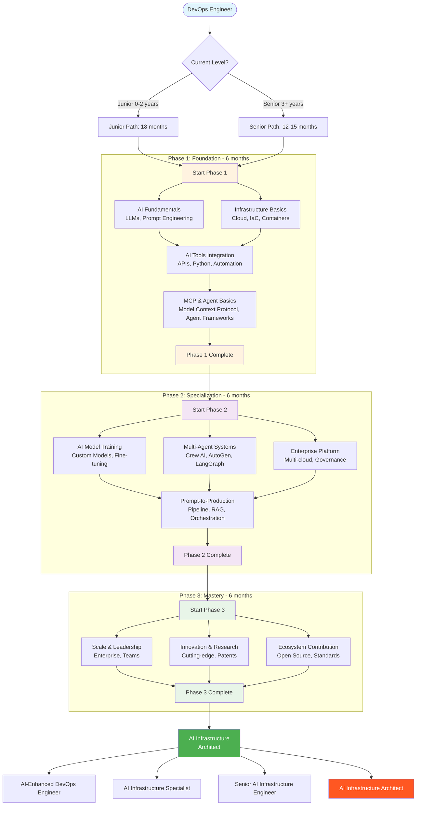

# AI Infrastructure Architect Roadmap - Mermaid Diagram

*This file contains the mermaid source code for the AI Infrastructure Architect Roadmap*

## Instructions for Image Export

1. Copy the mermaid code above
2. Go to [Mermaid Live Editor](https://mermaid.live/) or use your preferred mermaid tool
3. Paste the code and export as PNG/SVG
4. Save the image as `ai-roadmap-diagram.png` in the same directory
5. The roadmap file will reference this image

## Learning Path Structure

### Parallel Learning Opportunities:
- **Phase 1**: AI Fundamentals ∥ Infrastructure Basics → AI Tools Integration → MCP & Agent Basics
- **Phase 2**: AI Model Training ∥ Multi-Agent Systems ∥ Enterprise Platform → Prompt-to-Production  
- **Phase 3**: Scale & Leadership ∥ Innovation & Research ∥ Ecosystem Contribution (all parallel)

This structure optimizes learning efficiency by allowing independent skill development where no dependencies exist.
